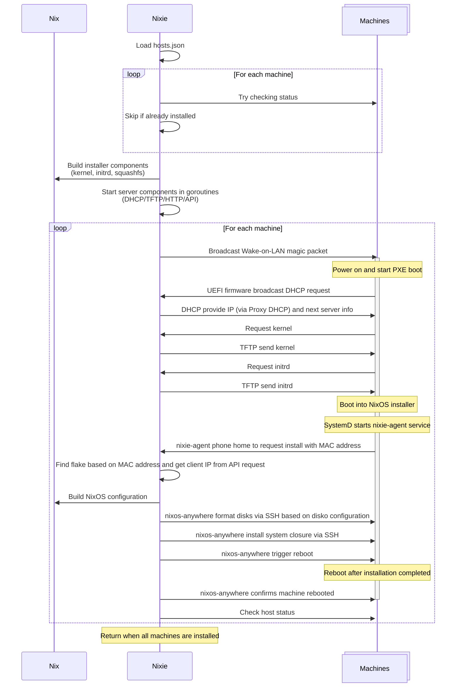

# Nixie

NixOS PXE boot install with
[Wake-on-LAN](https://en.wikipedia.org/wiki/Wake-on-LAN),
[Pixiecore](https://github.com/danderson/netboot/tree/main/pixiecore) and
[nixos-anywhere](https://nix-community.github.io/nixos-anywhere).
Currently, only `x86_64-linux` is supported.

## Features

- [x] Simple, declarative JSON configuration
- [x] Build a custom NixOS installer from a flake
- [x] Built-in PXE server to serve netboot components from the custom installer
- [ ] Host status check with IP discovery
- [ ] Remote power-on with Wake-on-LAN
- [ ] Custom agent and API to manage the installation process
- [ ] Install NixOS from a flake using nixos-anywhere
- [x] Stateless

## Usage

Example command to boot a custom NixOS installer and install the corresponding
NixOS configuration from [`./examples/flake.nix`](./examples/flake.nix) on
multiple bare-metal machines based on the MAC addresses defined in
[`./examples/hosts.json`](./examples/hosts.json).

```sh
# Running as root for privileged ports
sudo nixie \
    --installer ./examples#nixosConfigurations.installer \
    --flake ./examples \
    --hosts ./examples/hosts.json \
    --ssh-key ~/.ssh/id_ed25519
```

TODO add a demo video/asciinema.

Please see the full example in [`./examples`](./examples).

## How it works

TODO refine the diagram after implementation.


