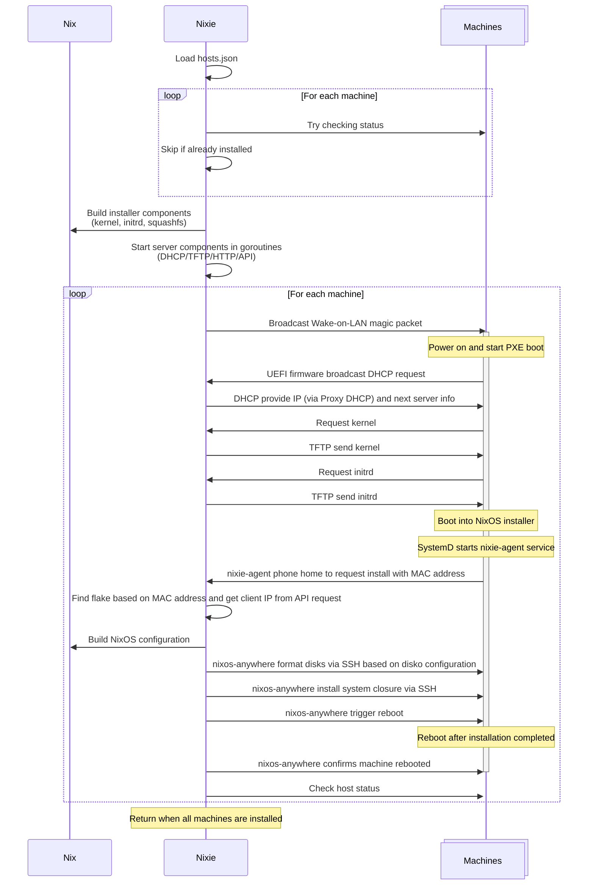

# Nixie


Open-source bare metal provisioning engine for NixOS. Nixie enables zero-touch
deployment of NixOS to multiple machines over the network, turning blank hard
drives into fully configured systems in minutes.

> [!WARNING]
> Basic [features](#features) are functional and you can try them out, but some
> parts are still missing and there are known issues.

Nixie is a simpler, stateless alternative to [Foreman](https://theforeman.org),
[MAAS](https://canonical.com/maas), [OpenStack
Ironic](https://docs.openstack.org/ironic),
[Tinkerbell](https://tinkerbell.org), etc., focusing on NixOS deployments on
bare metal (though it can also be used in virtualized environments).

## Features

Currently, only `x86_64-linux` is supported.

- [x] Simple, declarative JSON configuration
- [x] Build a custom NixOS installer from a flake
- [x] Built-in PXE server based on [Pixiecore](https://github.com/danderson/netboot/tree/main/pixiecore) to serve netboot components from the custom installer
- [x] Install NixOS from a flake using [nixos-anywhere](https://nix-community.github.io/nixos-anywhere)
- [ ] Remote power-on with [Wake-on-LAN](https://en.wikipedia.org/wiki/Wake-on-LAN)
- [ ] Host status check with IP discovery
- [x] Stateless and ephemeral [^1]
- [x] Fast, under 2 minutes to install NixOS from empty hard drives [^2]
- [ ] Support IPv6 single-stack

[^1]: No pre-configured PXE server is required to install other machines - you
    only need to run Nixie on your laptop or workstation. This solves the
    "first machine in the data center" problem: in bare-metal setups with
    persistent PXE servers, you would otherwise need to automate the installation
    of the PXE server itself.
[^2]: Using the provided examples with a warm cache on a 1 Gbps network.
    Factors that affect the speed include whether the configuration has been
    cached in the Nix store, the size of the NixOS configuration, the network
    speed, etc.

## Usage

Example command to boot a custom NixOS installer and install the corresponding
NixOS configuration from [`./examples/flake.nix`](./examples/flake.nix) on
multiple bare-metal machines based on the MAC addresses defined in
[`./examples/hosts.json`](./examples/hosts.json).

```sh
# Running as root for privileged ports
sudo nixie \
    --installer ./examples#nixosConfigurations.installer \
    --flake ./examples \
    --hosts ./examples/hosts.json \
    --ssh-key ~/.ssh/id_ed25519
```

TODO add a demo video/asciinema.

Please see the full example in [`./examples`](./examples).

## How it works

TODO refine the diagram after implementation.



## Acknowledgements

> This project is a rewrite of my previous ephemeral PXE server implementation
> in my [khuedoan/homelab](https://github.com/khuedoan/homelab) repository,
> which used a stateless PXE server in Docker with Ansible templating and
> targeted generic Linux distributions. It has been rebuilt from the ground up
> for NixOS, offering a more integrated and robust experience in this project.
> All credits from the previous implementation are also referenced here, as
> similar knowledge and concepts apply.

- Ephemeral PXE server [^1] inspired by [Minimal First Machine in the DC](https://speakerdeck.com/amcguign/minimal-first-machine-in-the-dc)
- [NixOS netboot with pixiecore](https://nixos.wiki/wiki/Netboot)
- [The Pixiecore library](https://github.com/danderson/netboot/tree/main/pixiecore)
- Custom agent for the installation process inspired by [OpenStack ironic-python-agent](https://opendev.org/openstack/ironic-python-agent) and [Tinkerbell Worker](https://tinkerbell.org/docs/services/tink-worker)
- Wireshark's [WakeOnLAN wiki page](https://wiki.wireshark.org/WakeOnLAN)
- AMD's [Magic Packet Technology](https://www.amd.com/content/dam/amd/en/documents/archived-tech-docs/white-papers/20213.pdf) white paper
